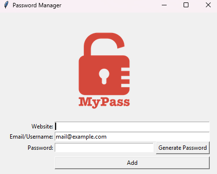

## Password Manager 🔐

A simple and secure password manager built with Python and Tkinter. This application allows users to store and manage their passwords securely.

### Features 🚀

- Store website, email, and password combinations in a local file.
- Generate secure random passwords.
- Validate user input to ensure all fields are filled correctly.
- Display error messages for invalid input.
- Search for specific credentials by website.
- User-friendly GUI built with Tkinter.

### Preview 📸



### Installation 📦

1. Clone the repository:
   ```bash
   git clone https://github.com/AenuHub/password-manager.git
   ```
2. Navigate to the project directory:
   ```bash
   cd password-manager
   ```

### Usage

1. Run the application:
   ```bash
   python main.py
   ```
2. Enter the website, email, and password in the respective fields.
3. Click "Add" to save the credentials.
4. Use the "Generate Password" button to create a secure password.

### Contributing

Contributions are welcome! If you have suggestions for improvements or new features, please open an issue or submit a pull request.